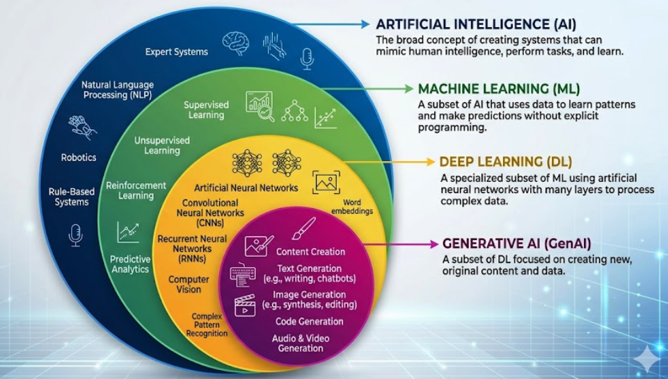
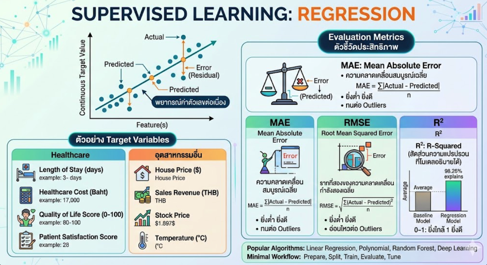
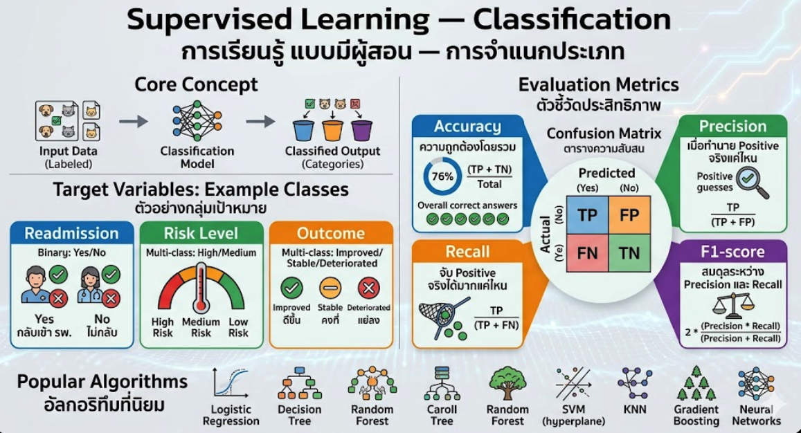
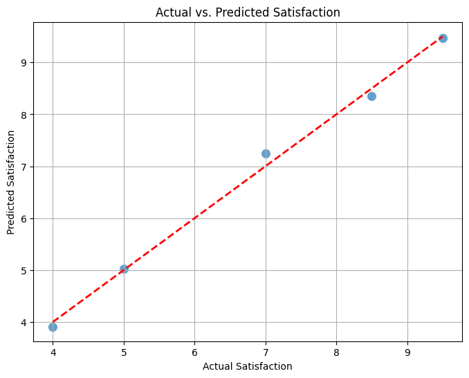

<!-- _class: lead -->

<style scoped>
.logo-bar { position: absolute; top: 36px; right: 64px; display: flex; align-items: center; gap: 16px; }
.logo-bar img { width: 100px; height: 100px; object-fit: contain; }
</style>

<div class="logo-bar">
  
  
</div>

# From Research Questions to<br>Machine Learning-based<br>Research Design

<div class="subtitle">AI for Research — Day 2</div>

**ผศ.ดร.ทวีศักดิ์ สมานชื่น**
กลุ่มสาขาวิชา ITM | MULKC 

มหาวิทยาลัยมหิดล | May 2026

---

## สิ่งที่จะทำในช่วงเช้า

<div class="columns">

<div>

**ทักษะที่จะได้รับ**
- แปลงคำถามวิจัยเป็นโจทย์ ML
- เข้าใจประเภทของ Machine Learning
- รู้จัก target, features, dataset, metrics
- ออกแบบ ML-based analysis plan

</div>

<div>

**เชื่อมจากวันที่ 1**
- AI for Research & HIRF Framework
- Research Question & Objective
- Literature Review & Gap Analysis

**ต่อยอดช่วงบ่าย**
- Mini Proposal พร้อม ML methodology
- Preliminary Findings & Presentation

</div>

</div>

---

## เป้าหมายของช่วงเช้า (Morning Output)

ก่อนพักเที่ยง ผู้เข้าอบรมควรมี:

| # | ผลลัพธ์ |
|---|---|
| 1 | **Research Question Mapping** — คำถามวิจัยที่แปลงเป็นโจทย์ ML |
| 2 | **Data Science Objective** — เป้าหมายการวิเคราะห์ข้อมูล |
| 3 | **ML Task** — ประเภทของ ML ที่เหมาะกับงานวิจัย |
| 4 | **Target Variable & Features** — ตัวแปรเป้าหมายและตัวแปรอิสระ |
| 5 | **Draft ML-based Analysis Plan** — แผนการวิเคราะห์เบื้องต้น |

---

## ทำไม ML ถึงสำคัญในงานวิจัย?

<div class="columns">

<div>

**ML ช่วยได้**
- ค้นหา pattern จากข้อมูลขนาดใหญ่
- ทำนายหรือจำแนกกลุ่ม
- จัดการข้อมูลหลายตัวแปรพร้อมกัน
- วิเคราะห์ข้อมูลข้อความ (NLP, LLM)

</div>

<div>

**ML ไม่ได้แทนที่**
- Research design ที่ดี
- Researcher judgment
- Ethical reasoning
- การตีความผลในบริบทวิชาการ

> **หลักการ**: ML คือ "เครื่องมือวิเคราะห์" — ไม่ใช่คำตอบสำเร็จรูป

</div>

</div>

---

<!-- _class: divider -->

## 02
## From Research Questions to ML Problems

แปลงคำถามวิจัยเป็นโจทย์ Machine Learning

---

## Research Question คืออะไร?

คำถามหลักที่งานวิจัยต้องการตอบ — ต้องชัดเจน วัดได้ และสอดคล้องกับ methodology

**ตัวอย่าง Research Questions ในการวิจัยด้านสุขภาพ:**

- ปัจจัยใดสัมพันธ์กับความเสี่ยงของผู้ป่วยโรคเรื้อรัง?
- สามารถทำนายผลลัพธ์การรักษาของผู้ป่วยล่วงหน้าได้หรือไม่?
- กลุ่มผู้ป่วยมีรูปแบบพฤติกรรมที่แตกต่างกันอย่างไร?
- ความคิดเห็นของผู้รับบริการสะท้อนประเด็นสำคัญใดบ้าง?

> คำถามที่ดีคือ คำถามที่ตอบได้ด้วยข้อมูลที่มีอยู่จริง

---

## Research Question vs Data Science Question

| Research Question | Data Science Question |
|---|---|
| ปัจจัยใดสัมพันธ์กับผลลัพธ์? | ตัวแปรใดช่วยทำนายผลลัพธ์ได้ดีที่สุด? |
| กลุ่มตัวอย่างมีลักษณะอย่างไร? | สามารถแบ่งกลุ่มจาก pattern ได้หรือไม่? |
| ความคิดเห็นสะท้อนประเด็นใด? | สามารถจำแนก/สกัด theme จากข้อความได้หรือไม่? |
| การรักษาวิธีใดให้ผลดีกว่า? | โมเดลทำนายผลได้แม่นยำแค่ไหน? |

> Research Question → บอก **ทำไม**  
> Data Science Question → บอก **จะวิเคราะห์อย่างไร**

---

## Research Objective vs Data Science Objective

**ตัวอย่างในโจทย์การวิจัยด้านคลินิก:**

<div class="columns">

<div>

**Research Objective**

เพื่อศึกษาปัจจัยที่เกี่ยวข้องกับการกลับมารักษาซ้ำของผู้ป่วย ภายใน 30 วันหลังจำหน่าย

</div>

<div>

**Data Science Objective**

เพื่อพัฒนาโมเดลจำแนกผู้ป่วยที่มีความเสี่ยงสูงต่อการกลับมารักษาซ้ำภายใน 30 วันโดยใช้ข้อมูล EHR

</div>

</div>

> Research Objective → กรอบวิชาการ  
> Data Science Objective → เป้าหมายการสร้างโมเดล

---

## ทำไมต้องแยก Data Science Objective?

**Research Objective อย่างเดียวไม่พอ** เพราะมันตอบแค่ "ศึกษาอะไร" ไม่ได้บอกว่า "จะวิเคราะห์ข้อมูลอย่างไร"

| ถ้ามีแค่ Research Objective | เมื่อเพิ่ม Data Science Objective |
|---|---|
| บอกได้ว่า *ต้องการรู้อะไร* | บอกได้ว่า *จะสร้างโมเดลอะไร* |
| กว้างเกินไปสำหรับ ML design | ระบุ task, target, และ metric ได้ทันที |
| Reviewer ไม่รู้ว่าจะใช้ ML อย่างไร | Methodology ชัดเจน ตรวจสอบได้ |
| เขียน Methods section ยาก | เชื่อมตรงสู่ dataset และ algorithm |

> **กุญแจสำคัญ**: งานวิจัยที่ใช้ ML ต้องการ *สองระดับ* — ระดับวิชาการ (Research) และระดับเทคนิค (Data Science)

---

## Formula: จาก Research Topic สู่ ML Project
<div class="columns">

<div>

```
Research Topic
     ↓
Research Question
     ↓
Research Objective + Data Science Objective 
     ↓
ML Task  →  Target Variable  →  Features
     ↓
Evaluation Metrics
     ↓
Research Conclusion
```
</div>
<div>

> ทุกขั้นตอนต้องสอดคล้องกัน — ไม่ใช่เลือก ML task ก่อนแล้วค่อยหา objective ทีหลัง
<div>

---

## เมื่อใดควรใช้ ML ในงานวิจัย?

<div class="columns">

<div>

**ควรใช้ ML เมื่อ:**
- ต้องการทำนายผลลัพธ์
- ต้องการจำแนกกลุ่ม
- ต้องการหากลุ่มแฝง
- มีข้อมูลหลายตัวแปร
- มีข้อมูลข้อความจำนวนมาก
- ต้องการ pattern ที่มองไม่เห็น

</div>

<div>

**ไม่ควรใช้ ML เมื่อ:**
- ข้อมูลน้อยมาก (< 100 observations)
- คำถามต้องการแค่ descriptive statistics
- ไม่มี target หรือข้อมูลที่ชัดเจน
- ไม่สามารถอธิบายผลลัพธ์ได้

</div>

</div>

---

## ตัวอย่างที่ 1 — Classification

**โจทย์:** ทำนายความเสี่ยงการกลับมารักษาซ้ำภายใน 30 วัน

| ส่วนประกอบ | รายละเอียด |
|---|---|
| **ML Task** | Classification (Binary) |
| **Target** | Readmission: Yes / No |
| **Features** | อายุ เพศ โรคร่วม จำนวนวันนอน ผลตรวจ |
| **Metrics** | Precision, Recall, F1-score |

> เหมาะกับงานวิจัยที่ต้องการระบุกลุ่มเสี่ยง

---

## ตัวอย่างที่ 2 — Regression

**โจทย์:** ทำนายระยะเวลานอนโรงพยาบาล (Length of Stay)

| ส่วนประกอบ | รายละเอียด |
|---|---|
| **ML Task** | Regression |
| **Target** | จำนวนวันนอน (ตัวเลขต่อเนื่อง) |
| **Features** | อายุ โรคหลัก ความรุนแรง ผลแล็บ |
| **Metrics** | MAE, RMSE, R² |

> เหมาะกับงานวิจัยที่ต้องการประมาณค่าหรือพยากรณ์

---

## ตัวอย่างที่ 3 — Clustering & NLP

<div class="columns">

<div>

**Clustering**

แบ่งกลุ่มผู้ป่วยตามพฤติกรรมสุขภาพ

- ไม่มี target ล่วงหน้า
- ค้นหา pattern แฝง
- Output: Cluster profiles
- ใช้: K-Means, Hierarchical

</div>

<div>

**NLP / Text Mining**

วิเคราะห์ความคิดเห็นจากแบบสอบถาม

- ข้อมูลข้อความ (open-ended)
- สกัด theme / ความรู้สึก
- Output: Topics, Sentiment
- ใช้: LDA, BERT, LLM

</div>

</div>

---

<!-- _class: divider -->

## 03
## Introduction to Machine Learning for Research

ความรู้พื้นฐาน ML ที่นักวิจัยต้องรู้

---

## Machine Learning คืออะไร?

> **Machine Learning** คือการให้คอมพิวเตอร์เรียนรู้รูปแบบจากข้อมูล  
> เพื่อทำนาย จำแนก หรือค้นหารูปแบบใหม่ — โดยไม่ต้องโปรแกรมกฎทุกข้อด้วยตนเอง

**ในงานวิจัย ML คือ:**
- เครื่องมือวิเคราะห์ข้อมูลขั้นสูง
- วิธีหา pattern จากข้อมูลซับซ้อน
- แนวทางสร้างโมเดลทำนายหรือจำแนก

> ML ไม่ใช่แค่ "เทคโนโลยีล้ำสมัย" — คือ **analytic tool** ที่มีจุดแข็งและข้อจำกัดชัดเจน

---

## AI vs ML vs Deep Learning vs Generative AI

<div class="center">



</div>

---

## Traditional Statistics vs Machine Learning

| ประเด็น | Statistics | Machine Learning |
|---|---|---|
| **เป้าหมาย** | อธิบาย / ทดสอบสมมติฐาน | ทำนาย / จำแนกรูปแบบ |
| **คำถาม** | ปัจจัยใดมีนัยสำคัญ? | โมเดลทำนายได้ดีแค่ไหน? |
| **ผลลัพธ์** | p-value, CI, effect size | accuracy, F1, RMSE |
| **จุดแข็ง** | ตีความง่าย มี assumption ชัด | จัดการ pattern ซับซ้อน |
| **จุดเสี่ยง** | อาจละเลย non-linear | overfitting / black box |

> ทั้งสองแนวทางใช้ร่วมกันได้ในงานวิจัย — เลือกให้ตรงกับคำถาม

---

## ประเภทของ Machine Learning

<div class="columns">

<div>

**Supervised Learning** *(มีคำตอบ)*
- มี input และ output ที่ถูกต้อง
- ใช้: Classification, Regression
- ตัวอย่าง: ทำนาย readmission

**Unsupervised Learning** *(ไม่มีคำตอบ)*
- ไม่มี target variable
- ใช้: Clustering, Dimensionality Reduction
- ตัวอย่าง: แบ่งกลุ่มผู้ป่วย

</div>

<div>

**Semi-supervised Learning**
- มีข้อมูล labeled บางส่วน
- ใช้เมื่อ labeling มีต้นทุนสูง

**Reinforcement Learning**
- เรียนรู้จาก reward/punishment
- ใช้ใน clinical decision support

> **Workshop นี้เน้น**: Supervised & Unsupervised

</div>

</div>

---

<div class="center">



</div>

---

## Supervised Learning — Regression

<div class="columns">

<div>

ใช้เมื่อ **target เป็นค่าตัวเลขต่อเนื่อง**

**ตัวอย่าง target variable:**
- Length of Stay (จำนวนวัน)
- Healthcare Cost (บาท)
- Quality of Life Score (0–100)
- Patient Satisfaction Score

</div>
<div>

**Evaluation Metrics:**
- **MAE** — Mean Absolute Error
- **RMSE** — Root Mean Squared Error
- **R²** — สัดส่วนความแปรปรวนที่โมเดลอธิบายได้
</div>

---

## Regression Models — ตัวอย่างโมเดลที่ใช้บ่อย

<div class="columns">
<div>

**Linear Regression** *(พื้นฐาน)*

$$\hat{y} = \beta_0 + \beta_1 x_1 + \beta_2 x_2 + \cdots + \beta_p x_p$$

- $\hat{y}$ = ค่าที่ทำนาย (เช่น จำนวนวันนอน)
- $\beta_0$ = intercept (ค่าเริ่มต้น)
- $\beta_1 \ldots \beta_p$ = coefficients (น้ำหนักของแต่ละ feature)
- $x_1 \ldots x_p$ = feature values

> ตีความได้ง่าย $\beta_j$  → $\hat{y}$ เปลี่ยนเท่าไร

</div>
<div>


| โมเดล | จุดเด่น | เหมาะกับ |
|---|---|---|
| **Linear Regression** | ตีความ coefficient ได้ | ข้อมูลเชิงเส้น |
| **Ridge / Lasso** | ป้องกัน overfitting | features มาก |
| **Decision Tree** | เข้าใจง่าย | non-linear |
| **Random Forest** | แม่นยำสูง | ข้อมูลซับซ้อน |


> **เริ่มต้นด้วย Linear Regression เสมอ** — ถ้าผลไม่ดีค่อยลองโมเดลซับซ้อนขึ้น

</div>
</div>

---

## Regression Metric 1 — MAE (Mean Absolute Error)

$$MAE = \frac{1}{n}\sum_{i=1}^{n}|y_i - \hat{y}_i|$$

**ความหมาย:** ค่าเฉลี่ยของข้อผิดพลาดสัมบูรณ์ระหว่างค่าจริง ($y_i$) กับค่าที่ทำนาย ($\hat{y}_i$)
<div class="columns">
<div>

| คุณสมบัติ | รายละเอียด |
|---|---|
| **หน่วย** | เดียวกับ target (เช่น วัน, บาท, คะแนน) |
| **ตีความ** | "โมเดลผิดพลาดเฉลี่ย X หน่วย" |
| **จุดเด่น** | ตีความง่าย ทนต่อ outlier |
| **จุดอ่อน** | ไม่ลงโทษ error ขนาดใหญ่พิเศษ |

</div>
<div>

> **ใช้เมื่อ:** ข้อมูลมี outlier มาก หรือต้องการ metric ที่ตีความในหน่วยเดียวกับ target
<div>

---

## Regression Metric 2 — RMSE (Root Mean Squared Error)

$$RMSE = \sqrt{\frac{1}{n}\sum_{i=1}^{n}(y_i - \hat{y}_i)^2}$$

**ความหมาย:** รากที่สองของค่าเฉลี่ยของ error ยกกำลังสอง — ลงโทษ error ขนาดใหญ่หนักกว่า MAE

<div class="columns">
<div>

| คุณสมบัติ | รายละเอียด |
|---|---|
| **หน่วย** | เดียวกับ target |
| **ตีความ** | คล้าย MAE แต่ให้น้ำหนักกับ error ใหญ่มากกว่า |
| **จุดเด่น** | ไวต่อ error ขนาดใหญ่ (sensitive to outliers) |
| **จุดอ่อน** | ถูก outlier ดึงค่าได้ง่าย |

</div>
<div>

> **ใช้เมื่อ:** ความผิดพลาดขนาดใหญ่มีผลกระทบสูงในบริบทวิจัย เช่น ทำนายต้นทุนการรักษา
</div>

---

## Regression Metric 3 — R² (Coefficient of Determination)

$$R^2 = 1 - \frac{\sum_{i=1}^{n}(y_i - \hat{y}_i)^2}{\sum_{i=1}^{n}(y_i - \bar{y})^2}$$

**ความหมาย:** สัดส่วนความแปรปรวนของ target ที่โมเดลอธิบายได้ เทียบกับค่าเฉลี่ย ($\bar{y}$)

<div class="columns">
<div>

| R² | ความหมาย |
|---|---|
| 0.9+ | โมเดลอธิบายได้ดีมาก |
| 0.7–0.9 | ดี |
| 0.5–0.7 | ปานกลาง |
| < 0.5 | ควรปรับปรุง |
| ≤ 0 | แย่กว่าใช้ค่าเฉลี่ย |

</div>
<div>

**จุดเด่น:** ไม่มีหน่วย เปรียบเทียบข้ามโมเดลได้ง่าย

**จุดอ่อน:** ค่าสูงไม่ได้แปลว่าโมเดลดีเสมอ  อาจ overfit ได้

> **ใช้เมื่อ:** ต้องการรู้ว่าโมเดลอธิบาย **ความหลากหลาย** ของข้อมูลได้มากแค่ไหน

</div>
</div>


---


<div class="center">



</div>

---

## Supervised Learning — Classification
<div class="columns">
<div>

ใช้เมื่อ **target เป็นกลุ่มหรือ class**

**ตัวอย่าง target variable:**
- Readmission: Yes / No *(binary)*
- Risk Level: High / Medium / Low *(multi-class)*
- Outcome: Improved / Stable / Deteriorated

</div>
<div>

**Evaluation Metrics:**
- **Accuracy** — ความถูกต้องโดยรวม
- **Precision** — เมื่อทำนาย Positive จริงแค่ไหน
- **Recall** — จับ Positive จริงได้มากแค่ไหน
- **F1-score** — สมดุลระหว่าง Precision และ Recall
</div>

---

## Classification Models — ตัวอย่างโมเดลที่ใช้บ่อย

<div class="columns">
<div>

**Logistic Regression** *(พื้นฐาน)*

$$P(y=1|x) = \frac{1}{1 + e^{-(\beta_0 + \beta_1 x_1 + \cdots + \beta_p x_p)}}$$

- $P(y=1|x)$ = ความน่าจะเป็นที่ผลลัพธ์เป็น class 1
- $\beta_0 \ldots \beta_p$ = coefficients ของแต่ละ feature
- ใช้ Sigmoid function แปลงค่าเป็น 0–1

> ตีความ odds ratio ได้จาก $e^{\beta_j}$ — feature นั้นเพิ่มโอกาสเกิดผลกี่เท่า?

</div>
<div>

| โมเดล | จุดเด่น | เหมาะกับ |
|---|---|---|
| **Logistic Regression** | ตีความ OR ได้ | binary, เชิงเส้น |
| **Decision Tree** | เข้าใจง่าย เห็น rule | non-linear |
| **Random Forest** | แม่นยำสูง | ข้อมูลซับซ้อน |
| **XGBoost** | ประสิทธิภาพสูงมาก | class imbalance |

> **เริ่มต้นด้วย Logistic Regression เสมอ** — ตีความ coefficient ได้เหมือน regression

</div>
</div>

---

## Classification Metric 1 — Accuracy

$$Accuracy = \frac{TP + TN}{TP + TN + FP + FN}$$


<div class="columns">
<div>

**ความหมาย:** สัดส่วนของการทำนายที่ถูกต้องทั้งหมด

**Confusion Matrix:**

|  | ทำนาย Positive | ทำนาย Negative |
|---|---|---|
| **จริง Positive** | TP | FN |
| **จริง Negative** | FP | TN |

</div>
<div>

| คุณสมบัติ | รายละเอียด |
|---|---|
| **ช่วงค่า** | 0 ถึง 1 (ยิ่งสูงยิ่งดี) |
| **จุดเด่น** | ตีความง่าย เข้าใจได้ทันที |
| **จุดอ่อน** | เข้าใจผิดได้เมื่อมี class imbalance |

> **ระวัง:** ถ้า 95% เป็น Negative โมเดลที่ทำนาย Negative ทั้งหมดก็ได้ Accuracy = 0.95 — แต่ไม่มีประโยชน์

</div>
</div>

---

## Classification Metric 2 — Precision & Recall (Sensitivity)

<div class="columns">
<div>

**Precision** — ความแม่นยำเมื่อทำนาย Positive

$$Precision = \frac{TP}{TP + FP}$$

> "ในจำนวนที่ทำนายว่า Positive ถูกต้องกี่ราย?"  
> ใช้เมื่อ **FP มีต้นทุนสูง** (เช่น รักษาโดยไม่จำเป็น)

</div>
<div>

**Recall** — ความครบถ้วนในการจับ Positive

$$Recall = \frac{TP}{TP + FN}$$

> "ในจำนวน Positive จริงทั้งหมด จับได้กี่ราย?"  
> ใช้เมื่อ **FN มีต้นทุนสูง** (เช่น พลาดผู้ป่วยเสี่ยงสูง)

</div>
</div>

> **หลักการเลือก:** งานด้านการตรวจโรค → เน้น **Recall** (อย่าพลาด) | งานจัดสรรทรัพยากร → สมดุล **Precision & Recall**

---

## Classification Metric 3 — F1-score

$$F1 = 2 \times \frac{Precision \times Recall}{Precision + Recall}$$


<div class="columns">
<div>

**ความหมาย:** Harmonic mean ของ Precision และ Recall — สมดุลระหว่างสองตัว

| สถานการณ์ | Metric ที่เหมาะ |
|---|---|
| ต้องการไม่พลาด Positive | **Recall** สูง |
| ต้องการ Positive ที่ทำนายถูก | **Precision** สูง |
| ต้องการสมดุลทั้งคู่ | **F1-score** |
| class สมดุล เน้นภาพรวม | **Accuracy** |

</div>
<div>

**ตัวอย่างในงานวิจัยด้านสุขภาพ:**

- ทำนายผู้ป่วยเสี่ยงสูง → เน้น **Recall** (อย่าพลาด)
- คัดกรองรายการที่ต้องส่งต่อ → **Precision** (ลด false alarm)
- ประเมินโมเดลโดยรวม → **F1-score**

> F1 = 1.0 คือสมบูรณ์แบบ | F1 = 0.0 คือแย่ที่สุด

</div>
</div>

---

## Unsupervised Learning — Clustering
<div class="columns">
<div>

ใช้เมื่อ **ไม่มี target variable** และต้องการค้นหา pattern แฝง

**เหมาะกับ:**
- Exploratory research
- การสร้าง patient persona
- การค้นหากลุ่มย่อยในประชากร

</div>

<div>

**ตัวอย่าง:**
- กลุ่มผู้ป่วยตามพฤติกรรมสุขภาพ
- กลุ่มผู้รับบริการตามรูปแบบการใช้บริการ
- กลุ่มงานวิจัยตามหัวข้อหลัก

**Output:** Cluster profiles + Pattern interpretation
</div>

---

## Text Mining / NLP for Research

<div class="columns">
<div>

ใช้กับ **ข้อมูลข้อความ** ที่นักวิจัยมักมีอยู่แล้ว

**แหล่งข้อมูลที่ใช้ได้:**
- Abstract / Full-text บทความวิจัย
- Interview transcript
- Open-ended survey responses
- Patient feedback / Clinical notes
- Policy documents

</div>
<div>

**งานที่ทำได้:**
- **Topic Extraction** — หัวข้อหลักในข้อความ
- **Sentiment Analysis** — ทิศทางความคิดเห็น
- **Text Classification** — จำแนกประเภทข้อความ
- **Summarization** — สรุปเนื้อหา
</div>

---

## ML Pipeline สำหรับงานวิจัย

```
Raw Data - > Data Cleaning          (จัดการค่าหาย, outlier, format)
   ↓
Feature Engineering    (สร้างตัวแปร, encoding, scaling)
   ↓
Model Training         (เลือก algorithm, fit โมเดล)
   ↓
Model Evaluation       (วัดผลด้วย metrics ที่เลือก)
   ↓
Interpretation         (อธิบายผลในบริบทวิจัย)
   ↓
Research Conclusion    (ตอบ Research Question)
```

---

## Dataset Structure สำหรับ ML
<div class="columns">
<div>

แต่ละ **row = 1 observation** (หน่วยวิเคราะห์)

| Dataset | 1 Row คือ |
|---|---|
| ข้อมูลผู้ป่วย | ผู้ป่วย 1 คน |
| แบบสอบถาม | แบบสอบถาม 1 ชุด |
| บทความวิจัย | Abstract 1 บทความ |
| โครงการวิจัย | โครงการ 1 โครงการ |

</div>
<div>

**แต่ละ column คือ:**
- **Features** — ตัวแปรที่ใช้ทำนาย (input)
- **Target** — สิ่งที่ต้องการทำนาย (output)
- **Metadata** — ข้อมูลอ้างอิง (ID, date)
<div>

---

## Target Variable และ Features

| ส่วน | ความหมาย | ตัวอย่าง |
|---|---|---|
| **Target** | สิ่งที่ต้องการทำนาย/จำแนก | Readmission: Yes / No |
| **Features** | ตัวแปรที่ใช้ทำนาย | อายุ เพศ โรคร่วม ผลแล็บ |
| **Model** | วิธีเรียนรู้จากข้อมูล | Logistic Regression / Random Forest |
| **Metrics** | วิธีวัดประสิทธิภาพ | Recall / F1-score |

> ตั้งคำถามก่อนเสมอ: **"เราต้องการรู้อะไร?"** แล้วค่อยเลือก target

---

## Model Evaluation — สิ่งที่ต้องรู้

**หลักการพื้นฐาน:**
- โมเดลต้องวัดผล ไม่ใช่แค่สร้างได้
- ต้องแยก **Train / Test set** ก่อนเสมอ
- ระวัง **Overfitting** — โมเดล "จำ" แทนที่จะ "เรียนรู้"
- เลือก metric ให้ตรงกับโจทย์วิจัย

**ตัวอย่าง:**
- งานด้านการตรวจโรค → ให้น้ำหนัก **Recall** (อย่าพลาด True Positive)
- งานด้านทรัพยากร → สมดุล **Precision + Recall** = F1

---

<!-- _class: divider -->

## 04
## Python Lab — Hands-on ML for Research

ลองรัน ML จริงด้วย Python & Google Colab

---

## เป้าหมายของ Python Lab

ไม่ต้องเขียน code เอง — **ใช้ Notebook สำเร็จรูป** แล้วสังเกตผล

**ใน 30 นาทีนี้ ท่านจะได้:**
- เห็นว่า dataset จริงหน้าตาเป็นอย่างไร
- รัน Classification และดู metrics จริง
- รัน Clustering และดู cluster profiles
- เชื่อมโยงผลที่เห็นกับ concept ที่เรียนมา

**เปิด Notebook ได้ที่:**
> 🔗 [`https://colab.research.google.com`](https://colab.research.google.com) *(Google Colab — ไม่ต้องติดตั้งอะไร)*


---
## Introduction to Colab

<div class="columns">

<div>

**Google Colab คืออะไร?**
- Jupyter Notebook บนคลาวด์ของ Google
- รัน Python ได้ทันที — ไม่ต้องติดตั้ง
- มี GPU ฟรี (สำหรับงานที่ต้องการ)
- บันทึกใน Google Drive อัตโนมัติ

**เริ่มต้นใช้งาน:**
> 1. เปิด 🔗 [Basic Concept of Google Colab](https://github.com/toche7/MLPython1Day/blob/main/BasicColab.ipynb)


</div>

<div>

**หน้าตาของ Colab:**

| ส่วนประกอบ | หน้าที่ |
|---|---|
| **Cell** | กล่องที่ใส่ code หรือข้อความ |
| **▶ Run** | รัน cell นั้น |
| **Shift+Enter** | รัน แล้วเลื่อนไป cell ถัดไป |
| **Runtime** | เมนูรัน / restart ทั้งหมด |

> **สำคัญ:** รัน cell ตามลำดับจากบนลงล่างเสมอ

</div>

</div>


---

<!-- _class: divider -->

## 04.1
## Python Lab — Regression

ลองรัน ML จริงด้วย Python & Google Colab

---

## Data Set  

**ตัวอย่างข้อมูลความพึงพอใจผู้รับบริการ (5 ราย)**

| ผู้รับบริการ | เวลารอ (นาที) | คะแนน Staff (1–10) | ความพึงพอใจ (0–10) |
|:---:|:---:|:---:|:---:|
| คนที่ 1 | 10 | 9 | 8.5 |
| คนที่ 2 | 30 | 6 | 5.0 |
| คนที่ 3 | 5 | 10 | 9.5 |
| คนที่ 4 | 45 | 5 | 4.0 |
| คนที่ 5 | 20 | 8 | 7.0 |

<div class="columns">
<div>

Features (x): เวลารอ,  คะแนนสอบ staff

</div>
<div>

Target (y): ความพึงพอใจ

</div>
</div>

---

## Python Code

<div class="columns">
<div>

**โจทย์:** ทำนายคะแนนความพึงพอใจผู้รับบริการ (0–10)

```python
df = pd.DataFrame(data)
X = df[["waiting_time", "staff_score"]]
y = df["satisfaction"]
model = LinearRegression()
model.fit(X, y)
print("Coef:", model.coef_)   # น้ำหนักของแต่ละ feature
print("R2 :", round(r2_score(y, model.predict(X)), 3))
```

</div>
<div>

**อ่านผล:**

| ผลลัพธ์ | ความหมาย |
|---|---|
| `Coef[0]` ติดลบ | waiting นานขึ้น → คะแนนลด |
| `Coef[1]` เป็นบวก | staff ดีขึ้น → คะแนนเพิ่ม |
| **R²** ใกล้ 1 | โมเดลอธิบายข้อมูลได้ดี |
| **MAE** ต่ำ | ทำนายคลาดเคลื่อนน้อย |


</div>
</div>

> [Link Linear Regression](https://github.com/toche7/MLPython1Day/blob/main/BasicRegression.ipynb)

---

## Result — Regression Output

<div class="columns">
<div>


</div>
<div>

**ผลลัพธ์จากโมเดล:**

```
Coef: [-0.0009,  1.1036]
R²  : 0.996
```
| Feature | Coef | ความหมาย |
|---|---|---|
| `waiting_time` | −0.0009 | รอเพิ่ม 1 นาที → คะแนนลดเล็กน้อย |
| `staff_score` | +1.104 |  +1 คะแนน → satisfaction +1.1 |
</div>
</div>

**R² = 0.996** → โมเดลอธิบายความแปรปรวนได้ **99.6%** — แม่นยำมากสำหรับข้อมูล 5 ราย (ข้อควรระวัง overfit)

---

<!-- _class: divider -->

## 04.2
## Python Lab — Classification

ลองรัน ML จริงด้วย Python & Google Colab

---

## Dataset — ข้อมูลที่ใช้ใน Classification Lab

**ตัวอย่างข้อมูลนักเรียน: ผ่าน/ไม่ผ่านการสอบ (6 คน)**

| นักเรียน | ชั่วโมงอ่านหนังสือ | คะแนนเก่า (0–100) | ผ่านสอบ (1=ใช่, 0=ไม่) |
|:---:|:---:|:---:|:---:|
| คนที่ 1 | 1 | 40 | 0 |
| คนที่ 2 | 2 | 55 | 0 |
| คนที่ 3 | 3 | 60 | 1 |
| คนที่ 4 | 4 | 70 | 1 |
| คนที่ 5 | 5 | 80 | 1 |
| คนที่ 6 | 1 | 50 | 0 |

<div class="columns">
<div>

Features (x): ชั่วโมงที่อ่านหนังสือ,  คะแนนสอบเก่า

</div>
<div>

Target (y): ผ่านสอบ (1) หรือไม่ผ่าน (0)

</div>
</div>

---

## Python Code — Classification

<div class="columns">
<div>


```python
df = pd.DataFrame(data)
X = df[["hours_studied", "prev_score"]]
y = df["passed"]
model = LogisticRegression()
model.fit(X, y)
y_pred = model.predict(X)
print(classification_report(y, y_pred,
      target_names=["ไม่ผ่าน", "ผ่าน"]))
```

</div>
<div>


| Metric | ความหมาย |
|---|---|
| **Precision** | ทำนาย "ผ่าน" ถูกกี่ % |
| **Recall** | จับผู้ที่ผ่านจริงได้กี่ % |
| **F1-score** | สมดุล Precision + Recall |

> ถ้าต้องการไม่พลาดคนที่จะไม่ผ่าน → เน้น **Recall** ของ class "ไม่ผ่าน"

</div>
</div>

> [Link Logistic Regression](https://github.com/toche7/MLPython1Day/blob/main/BasicClassification.ipynb)


---

## Result — Classification Output

<div class="columns">
<div>

**ผลลัพธ์ classification_report:**

```
              precision  recall  f1-score
ไม่ผ่าน         1.00      1.00      1.00
ผ่าน           1.00      1.00      1.00
accuracy                          1.00
```


| Confusion Matrix| ทำนาย: ไม่ผ่าน | ทำนาย: ผ่าน |
|---|:---:|:---:|
| **จริง: ไม่ผ่าน** | 3 | 0 |
| **จริง: ผ่าน** | 0 | 3 |

</div>
<div>

**ตีความผล:**

| ผลลัพธ์ | ความหมาย |
|---|---|
| Accuracy = 1.0 | ทำนายถูกทั้งหมด |
| Recall (ผ่าน) = 1.0 | ไม่พลาดคนที่ควรผ่าน |
| Precision (ไม่ผ่าน) = 1.0 | ไม่ติด false alarm |

> ข้อควรระวัง: ข้อมูลน้อย (n=6) และ pattern ชัดมาก — accuracy สูงเพราะ overfit ไม่ใช่โมเดลดีจริง ต้องทดสอบกับข้อมูลใหม่

</div>
</div>

---
<!-- _class: divider -->

## 04.3
## Python Lab — Example for Research


---

## Dataset ที่ใช้ใน Lab

**Hospital Readmission Dataset** *(ข้อมูลจำลอง)*

| Column | ความหมาย | ประเภท |
|---|---|---|
| `age` | อายุผู้ป่วย | Feature (ตัวเลข) |
| `gender` | เพศ | Feature (categorical) |
| `num_comorbidities` | จำนวนโรคร่วม | Feature (ตัวเลข) |
| `length_of_stay` | วันนอนโรงพยาบาล | Feature / Target |
| `readmission_30d` | กลับมารักษาซ้ำใน 30 วัน | Target (0/1) |

> [Link Colab](https://github.com/toche7/MLPython1Day/blob/main/MLResearch.ipynb)

---

## Lab Part 1 — Explore the Data
<div class="columns">
<div>


```python
import pandas as pd
df = pd.read_csv("hospital_data.csv")

# ดูหน้าตาข้อมูล
df.head()
df.describe()
df["readmission_30d"].value_counts()
```

</div>
<div>

**สังเกต:**
- มีกี่ rows / columns?
- target มี class imbalance ไหม?
- column ใดมีค่าหาย (NaN)?

> อ้างอิง Code จากใน Colab เป็นหลัก

<div>

---

## Lab Part 2 — Regression
<div class="columns">
<div>


```python
from sklearn.ensemble import RandomForestRegressor
from sklearn.metrics import mean_absolute_error, r2_score

model = RandomForestRegressor()
model.fit(X_train, y_train)

y_pred = model.predict(X_test)
print("MAE:", mean_absolute_error(y_test, y_pred))
print("R²:", r2_score(y_test, y_pred))
```

</div>
<div>

**อ่านผล:**
- `MAE` — โมเดลผิดพลาดเฉลี่ยกี่วัน?
- `R²` — โมเดลอธิบายความแปรปรวนได้กี่ %?

> อ้างอิง Code จากใน Colab เป็นหลัก
</div>


---

## Lab Part 3 — Classification

<div class="columns">
<div>


```python
from sklearn.linear_model import LogisticRegression
from sklearn.metrics import classification_report

model = LogisticRegression()
model.fit(X_train, y_train)

y_pred = model.predict(X_test)
print(classification_report(y_test, y_pred))
```

</div>
<div>

**อ่านผล:**
- `precision` — เมื่อทำนาย Positive ถูกแค่ไหน
- `recall` — จับ Positive จริงได้มากแค่ไหน
- `f1-score` — สมดุลระหว่างสองตัวข้างต้น

> อ้างอิง Code จากใน Colab เป็นหลัก
</div>


---

## Lab Reflection — เชื่อมกับงานวิจัยของท่าน

**ตอบคำถามเหล่านี้ก่อนไปต่อ:**

| คำถาม | คำตอบของท่าน |
|---|---|
| dataset ของท่านจะมีกี่ rows/columns ประมาณ? | |
| target ของท่านเป็น classification หรือ regression? | |
| metric ใดสำคัญที่สุดสำหรับงานวิจัยของท่าน? | |
| ท่านเห็น pattern อะไรที่น่าสนใจใน Lab? | |

> การตอบคำถามเหล่านี้คือการเริ่มต้น ML-based Analysis Plan ของท่านแล้ว

---

<!-- _class: divider -->

## 05
## Designing ML-based Analysis Plan

ออกแบบแผนการวิเคราะห์สำหรับงานวิจัย

---

## ML-based Analysis Plan คืออะไร?

> แผนที่บอกว่า: **ข้อมูลอะไร** — **ใช้โมเดลอะไร** — **วัดผลอย่างไร** — และ **ตีความอย่างไร**

**ประโยชน์ในงานวิจัย:**
- ทำให้ methodology ชัดเจนและ reproducible
- ช่วยให้ reviewer / committee เข้าใจ approach
- ป้องกัน HARKing (Hypothesizing After Results are Known)
- เป็นพื้นฐานของ Methods section ใน proposal

---

## องค์ประกอบของ ML-based Analysis Plan

| # | องค์ประกอบ | คำอธิบาย |
|---|---|---|
| 1 | **Research Objective** | เป้าหมายทางวิชาการ |
| 2 | **Data Science Objective** | เป้าหมายการสร้างโมเดล |
| 3 | **Dataset** | แหล่งข้อมูลและขนาด |
| 4 | **Target Variable** | สิ่งที่ต้องการทำนาย |
| 5 | **Features** | ตัวแปรที่ใช้ทำนาย |
| 6 | **Preprocessing** | วิธีจัดการข้อมูล |
| 7 | **Candidate Models** | Algorithm ที่จะทดสอบ |
| 8 | **Evaluation Metrics** | วิธีวัดประสิทธิภาพ |
| 9 | **Interpretation** | วิธีตีความผล |
| 10 | **Bias & Limitation** | ข้อจำกัดและความลำเอียง |

---

## Step 1 — Define the Data Science Objective

**โครงประโยคมาตรฐาน:**

> *"To develop a machine learning model to **[predict / classify / cluster / analyze]** [target or pattern] using [data source]."*

**ตัวอย่าง:**
- *"To develop a classification model to predict 30-day readmission risk using electronic health records."*
- *"To apply clustering to identify distinct patient subgroups based on health behavior patterns."*
- *"To use NLP to extract key themes from open-ended patient satisfaction surveys."*

---

## Step 2 — Identify Target Variable

**คำถามที่ต้องตอบก่อน:**

1. เราต้องการทำนายหรือจำแนก **อะไร** ?
2. คำตอบเป็น **ตัวเลข** หรือ **กลุ่ม** ?
3. วัดได้จริงหรือไม่?
4. มีข้อมูล target นี้ในชุดข้อมูลหรือไม่?

> Target ที่ชัดเจน = โมเดลที่ตีความได้  
> Target ที่คลุมเครือ = ผลลัพธ์ที่ไม่มีความหมาย

---

## Step 3 — Identify Features

**คำถามที่ต้องตอบ:**
- ตัวแปรใดอาจช่วยทำนาย target ได้?
- เก็บข้อมูลได้จริงหรือไม่?
- มีประเด็น **privacy / PDPA** หรือไม่?
- มีตัวแปรที่อาจก่อให้เกิด **bias** หรือไม่?

**ประเภท features ที่พบบ่อยในวิจัยด้านสุขภาพ:**
- Demographic: อายุ เพศ การศึกษา
- Clinical: โรคร่วม ผลตรวจ การรักษา
- Behavioral: พฤติกรรมสุขภาพ การใช้บริการ
- Temporal: วันที่ ระยะเวลา ความถี่

---

## Step 4 — Choose ML Task

**Decision Rule:**

| คำถามวิจัย | ML Task |
|---|---|
| ต้องการทำนายตัวเลข | **Regression** |
| ต้องการจำแนกกลุ่ม (มี label) | **Classification** |
| ต้องการแบ่งกลุ่ม (ไม่มี label) | **Clustering** |
| ต้องการวิเคราะห์ข้อความ | **NLP / Text Mining** |

> เลือก ML task ให้สอดคล้องกับ research question — ไม่ใช่เลือกตามความถนัด

---

## Step 5 — Choose Evaluation Metrics

| ML Task | Metrics หลัก | ใช้เมื่อ |
|---|---|---|
| **Regression** | MAE, RMSE, R² | ต้องการทำนายค่าตัวเลข |
| **Classification** | Accuracy, Precision, Recall, F1 | ต้องการจำแนกกลุ่ม |
| **Clustering** | Silhouette Score | ต้องการวัดความชัดของกลุ่ม |
| **NLP** | F1, Topic Coherence | ต้องการวัดความแม่นยำ / ความสอดคล้อง |

> เลือก metric ให้ตรงกับโจทย์ — ถ้าต้องการไม่พลาดผู้ป่วยกลุ่มเสี่ยง ให้เน้น **Recall**

---

## Bias and Limitation ใน ML Research

**สิ่งที่ต้องระบุใน proposal:**

- **Sample bias** — กลุ่มตัวอย่างไม่ represent ประชากร
- **Missing data** — ข้อมูลที่หายไปไม่ใช่ Random
- **Class imbalance** — กลุ่มเป้าหมายมีสัดส่วนน้อย
- **Overfitting** — โมเดลทำงานดีในข้อมูล train แต่ไม่ generalize
- **Limited generalizability** — ผลใช้ได้เฉพาะบริบทนั้น
- **Lack of interpretability** — Black box models
- **Ethical concerns** — Privacy, fairness, informed consent

> การระบุ limitation อย่างตรงไปตรงมา = สัญญาณของงานวิจัยที่ดี

---

## วิธีเขียน ML Methodology ใน Proposal

**โครง paragraph มาตรฐาน:**

> *"This study will use a machine learning approach to **[predict/classify/analyze]** [target]. The dataset will include **[data source]** with variables such as **[features]**. Candidate models may include **[models]**. Model performance will be evaluated using **[metrics]**. Potential limitations include **[bias/limitation]**."*

---

## ตัวอย่าง Methodology Paragraph

> *"This study will develop a binary classification model to predict 30-day hospital readmission using electronic health records from [Hospital Name]. The dataset will include patient demographics, primary diagnosis, comorbidities, laboratory results, and length of previous stay. Candidate models include Logistic Regression, Random Forest, and XGBoost. Model performance will be evaluated using Recall and F1-score, prioritizing sensitivity for high-risk patients. Potential limitations include missing values, class imbalance, and limited generalizability to other hospital settings."*

---

<!-- _class: divider -->

## 06
## Morning Workshop

Research Question to ML-based Analysis Plan

---

## **Dataset 1 — Patient Readmission** 
ข้อมูลผู้ป่วยโรงพยาบาล 500 ราย

| Column | ประเภท |
|---|---|
| อายุ | Feature |
| เพศ  | Feature |
| โรคหลัก | Feature |
| จำนวนโรคร่วม | Feature |
| วันนอนครั้งที่แล้ว | Feature |
| กลับมาใน 30 วัน (0/1) | **Target** |
> [Link Dataset](https://raw.githubusercontent.com/toche7/DataSets/refs/heads/main/PatientReadmission.csv)

---

## **Dataset 2 — Nurse Workload & Burnout** 
แบบสอบถามพยาบาล 200 คน

| Column | ประเภท |
|---|---|
| ชั่วโมงทำงาน/สัปดาห์ | Feature |
| จำนวนผู้ป่วยดูแล | Feature |
| การสนับสนุนจากองค์กร | Feature |
| คะแนน Burnout (0–100) | **Target** |

> [Link Dataset](https://raw.githubusercontent.com/toche7/DataSets/refs/heads/main/nursesBurnout.csv)

---
## **Dataset 3 — Health Screening Survey**

ผลตรวจสุขภาพประจำปี 300 ราย

| Column | ประเภท |
|---|---|
| BMI  | Feature |
| น้ำตาล | Feature |
|  ความดัน | Feature |
| การออกกำลังกาย | Feature |
| ประวัติครอบครัว | Feature |
| กลุ่มเสี่ยงโรค (สูง/กลาง/ต่ำ) | **Target** |
> [Link Dataset](https://raw.githubusercontent.com/toche7/DataSets/refs/heads/main/healthSurveyData.csv)

---
## **Dataset 4 — Patient Satisfaction Survey**
แบบสอบถาม open-ended 300 ชุด

| Column | ประเภท |
|---|---|
| ความคิดเห็นการรักษา | Feature (text) |
| ความคิดเห็นบริการ | Feature (text) |
| ข้อเสนอแนะ | Feature (text) |
| Theme / Sentiment | **Target** |

> [Link Dataset](https://raw.githubusercontent.com/toche7/DataSets/refs/heads/main/patientSatisfaction.csv)

---

## Activity A — Research Question to ML Project

**เลือก 1 dataset จากหน้าก่อน หรือใช้ข้อมูลของท่านเอง แล้วกรอก:**

| Component | Your Project |
|---|---|
| **Research Topic** | |
| **Research Question** | |
| **Research Objective** | |
| **Data Science Objective** | |
| **ML Task** | Classification / Regression / Clustering / NLP |

> *เริ่มจาก dataset ที่เลือก แล้วถามตัวเองว่า "เราต้องการรู้อะไรจากข้อมูลนี้?"*

---

## Activity B — Target and Features Mapping

**กรอกตัวแปรสำหรับโจทย์ของท่าน:**

| Target Variable | Feature 1 | Feature 2 | Feature 3 | Feature 4 | Feature 5 |
|---|---|---|---|---|---|
|Y: | | | | | |

**คำถามประกอบ:**
- Target ของท่านเป็นตัวเลขหรือกลุ่ม?
- Features มาจากแหล่งข้อมูลใด?
- มี feature ที่มีปัญหา privacy หรือไม่?

---

## Activity C — ML Task & Metrics Selection

**เลือก ML Task ที่เหมาะกับโจทย์ของท่าน:**

- ☐ **Regression** — ทำนายค่าตัวเลขต่อเนื่อง
- ☐ **Classification** — จำแนกกลุ่มที่มี label
- ☐ **Clustering** — แบ่งกลุ่มโดยไม่มี label
- ☐ **NLP / Text Mining** — วิเคราะห์ข้อความ

**ระบุ Evaluation Metrics:**
- จะใช้ metric อะไร?
- metric นี้ตอบโจทย์วิจัยอย่างไร?
- ถ้า metric ดี แปลว่าอะไรในบริบทงานวิจัยของท่าน?

---

## ML-based Analysis Plan Canvas

| Component | Your Project |
|---|---|
| **Research Topic** | |
| **Research Objective** | |
| **Data Science Objective** | |
| **Dataset** | |
| **Target Variable** | |
| **Features** | |
| **ML Task** | |
| **Candidate Models** | |
| **Evaluation Metrics** | |
| **Bias / Limitation** | |

---

## Prompt Template สำหรับขอความช่วยเหลือจาก AI

```text
I am designing a research project on [topic]. My research question is: [research question]
Please help me convert it into a machine learning-based analysis plan. Include:
- Data science objective
- ML task (classification/regression/clustering/NLP)
- Target variable
- Input features
- Possible dataset
- Candidate models
- Evaluation metrics
- Potential limitations and biases
```

---

<!-- _class: divider -->

## 07
## From Morning to Afternoon

จาก ML Analysis Plan สู่ Mini Research Proposal

---

## เชื่อมต่อจากช่วงเช้าสู่ช่วงบ่าย

| Morning Output | Afternoon Proposal Section |
|---|---|
| Research Topic | Title |
| Research Question | Research Question (RQ) |
| Data Science Objective | Objective / Methodology |
| Target & Features | Data / Variables |
| ML Task | Analytical Method |
| Evaluation Metrics | Analysis Plan |
| Bias / Limitation | Limitation & Ethics |

> สิ่งที่ทำช่วงเช้า **ไม่ต้องทำใหม่** — แค่นำมาขยายใน proposal

---

## ช่วงบ่าย — Preview

**สิ่งที่จะทำในช่วงบ่าย:**

1. **Mini Proposal** — เขียน proposal ฉบับย่อด้วยกรอบ ML methodology
2. **Preliminary Findings** — ออกแบบผลลัพธ์เบื้องต้นที่คาดหวัง
3. **Presentation** — นำเสนอ proposal ต่อกลุ่ม
4. **Feedback** — รับ feedback จากผู้เข้าอบรมคนอื่นและวิทยากร

> เป้าหมาย: ออกไปพร้อม **draft proposal** ที่สามารถพัฒนาต่อได้จริง

---

## Checklist ก่อนพักเที่ยง

<div class="columns">
<div>

ตรวจสอบว่าท่านมีครบก่อนออกไปทานข้าว:

- ☐ Research Topic ที่ชัดเจน
- ☐ Research Question ที่วัดได้
- ☐ Data Science Objective
- ☐ ML Task ที่เลือกแล้ว
- ☐ Target Variable
- ☐ Features (อย่างน้อย 3–5 ตัว)
- ☐ Evaluation Metrics
- ☐ Draft ML-based Analysis Plan (Canvas)
</div>
<div>

> ถ้ายังไม่ครบ — ใช้เวลาพักสั้น ๆ คุยกับวิทยากรก่อนช่วงบ่าย

</div>
</div>